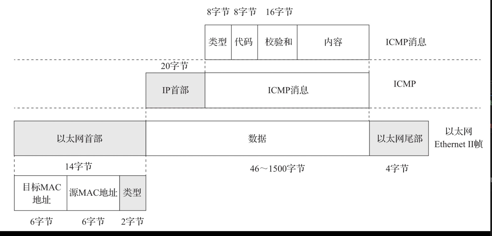

# 基于socket 编写的ebpf的步骤

1. 在用户态程序中定义一个原始套接字
2. 通过setsockopt将eBPF程序的FD附加到我们创建的原始套接字上。
3. 用户态程序从原始套接字中读取数据。
4. 在用户态程序退出前，取消附加在套接字上的eBPF程序及关闭套接字

解析数据包的关键是了解我们想要处理的网络协议的数据包格式，然后再在程序中按照对应的格式去解析数据包。

从上图可以看到第13 14两个字节能判断是否是icmp数据包
从15到35字节可以获取ip信息包括原地址和目的地址，以及判断是否是ICMP协议。

在eBPF程序中解析数据包的关键点是**如何读取数据包中特定位置特定字节的数据**。我们可以使用Linux内核源码中定义的网络相关结构体及**bpf_skb_load_bytes**辅助函数实现这个能力。
(1)bpf_skb_load_bytes
