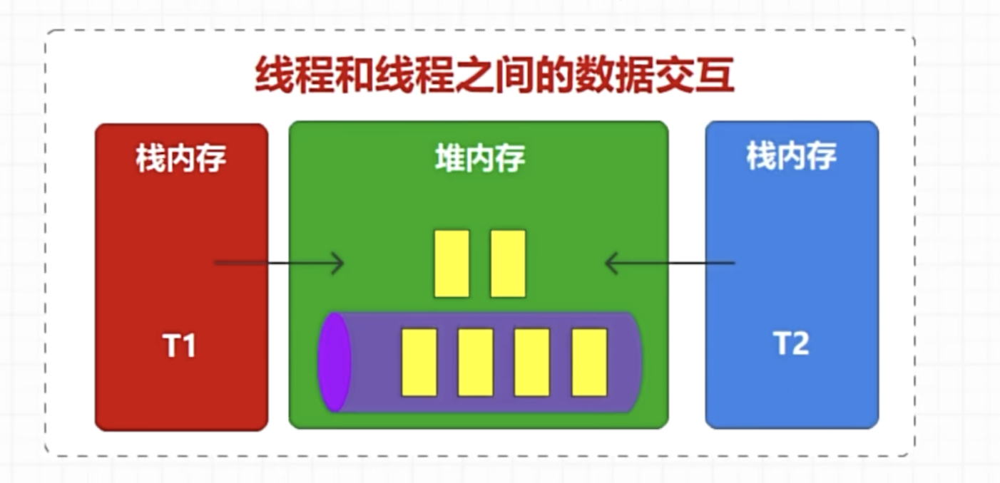
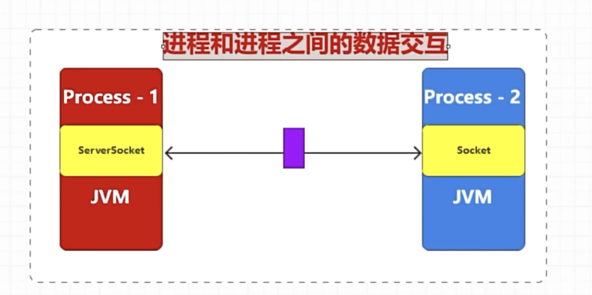

线程和线程的数据交互

进程和进程之间的数据交互

但是如果数据在第一个进程发送速度每秒1000条，而进程二每秒消耗800条，会容易造成消息积压，
这个时候我们需要中间增加一个数据缓冲区来解耦，这个时候数据缓冲区就可以扮演数据的中转，我们也称为消息中间件

kafka设计之初是为了解决日志方面的消息，为了数据可靠性，同时kafka会写入磁盘，写入的文件名叫.log

怎么保证数据顺序在传输中不被打乱？
Kafka 的主题（Topic）被划分为多个分区（Partition），每个分区内的消息是严格按照写入顺序存储和消费的。
生产者（Producer）向分区写入消息时，会按照发送顺序为每条消息分配一个单调递增的 偏移量（Offset），Offset 是分区内消息的唯一标识，类似 “序号”（如 0、1、2、3...）。
消费者（Consumer）从分区读取消息时，必须按 Offset 从小到大的顺序消费，保证了消费顺序与写入顺序一致。