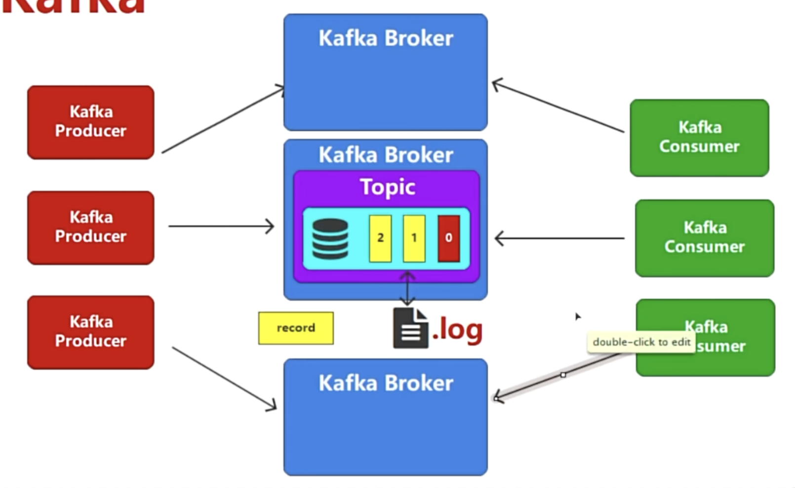
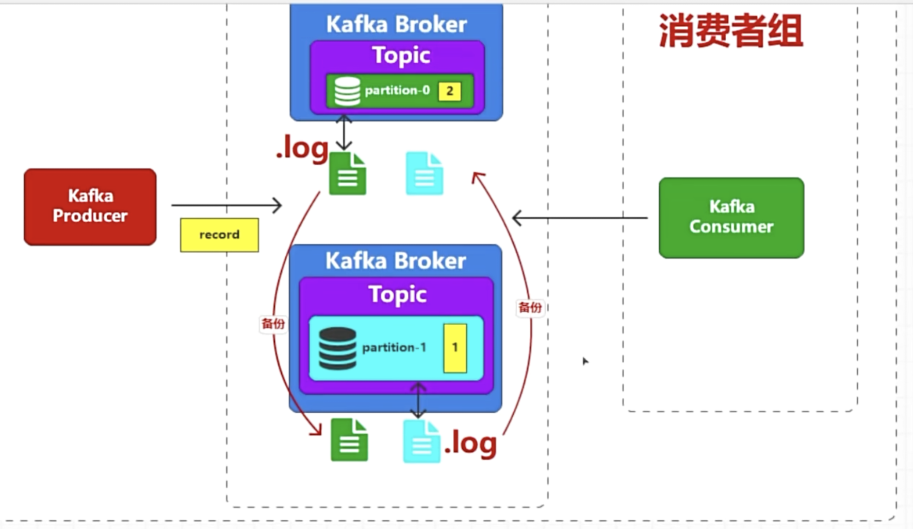
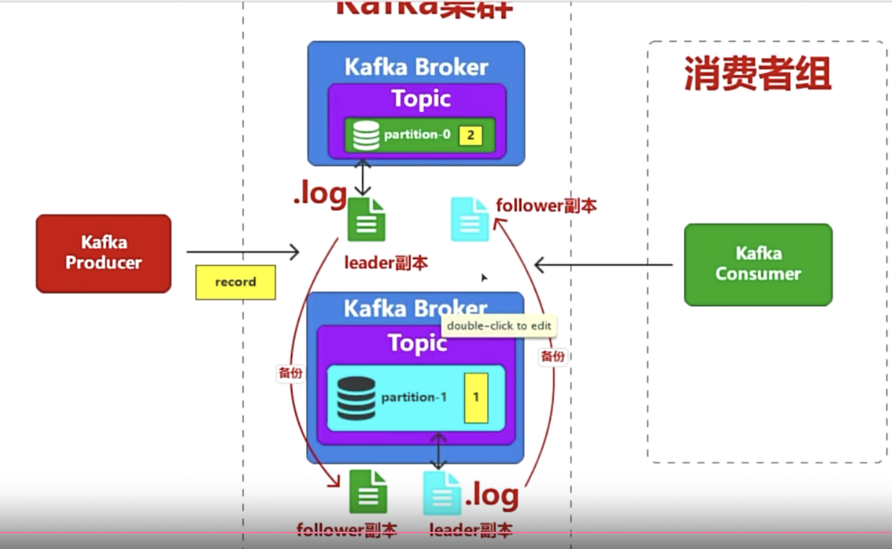
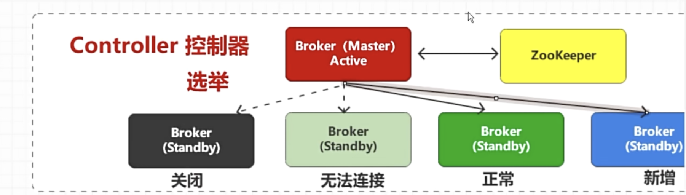
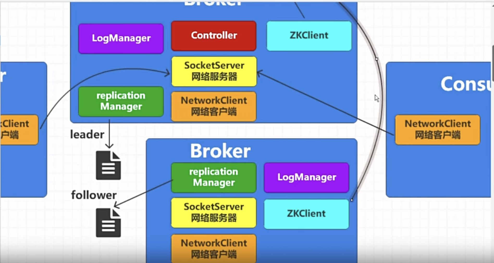

从数据可靠性来看，如果kafka broker其中一台挂了怎么办，所以kafka的设计就把.log放到其他broker server，如下图所示
但是kafka是没有备份的概念，kafka是称叫副本，多个副本中同时只有一个来进行读取操作，其他只是作为备份副本，具有读写能力的副本称为leader，其他备份的副本称为follower

kafka broker选举

broker会有一个replication manager，

Replication Manager负责监控和维护这些leader和folloer副本的状态. 
* Leader 选举：当分区的 Leader 副本所在的 broker 宕机时，Replication Manager 会从可用的 Follower 副本中选举新的 Leader，确保分区持续提供服务。
* 副本同步：监控 Follower 副本是否实时从 Leader 同步数据（通过 ISR 机制，即 In-Sync Replicas 同步副本集），确保 Follower 与 Leader 数据一致。
* 副本故障处理：当 Follower 副本因网络问题或 broker 故障脱离 ISR 时，Replication Manager 会标记其状态，并在恢复后触发重新同步。

Log Manager 是 broker 节点上负责管理分区日志（Partition Log）的核心组件，主要作用是处理 Kafka 消息的持久化存储、日志文件的生命周期管理以及相关的 I/O 操作优化，确保消息在磁盘上的高效存储和访问。
当生产者发送消息到 Kafka broker 时，Log Manager 负责将消息写入对应分区的日志文件（以磁盘文件形式存储）。每条消息会被追加到分区日志的末尾，保证了单个分区内的消息顺序性（与 Offset 对应）。
日志文件以分段（Segment）形式组织（默认每个段文件大小为 1GB），避免单个文件过大导致的管理和访问效率问题。
