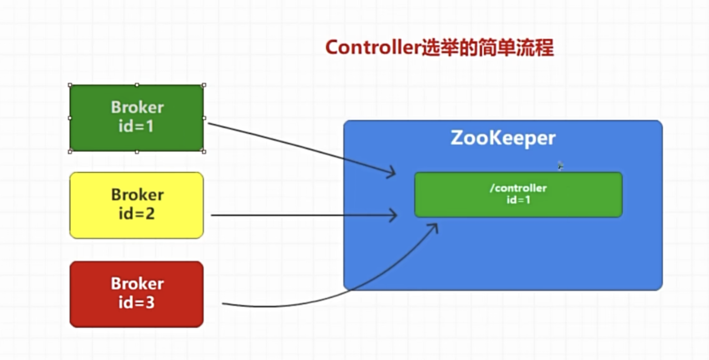
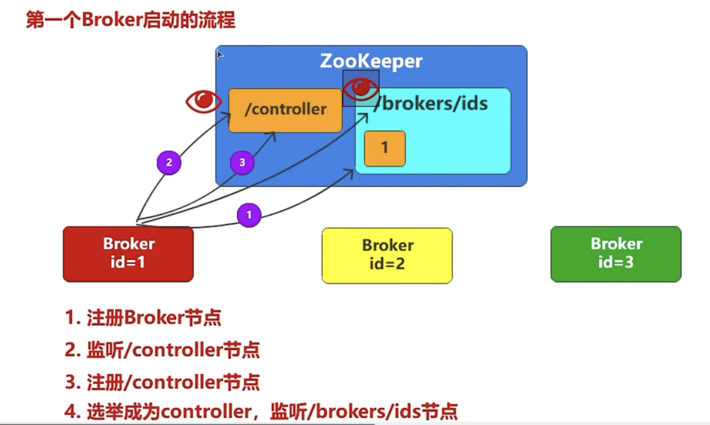
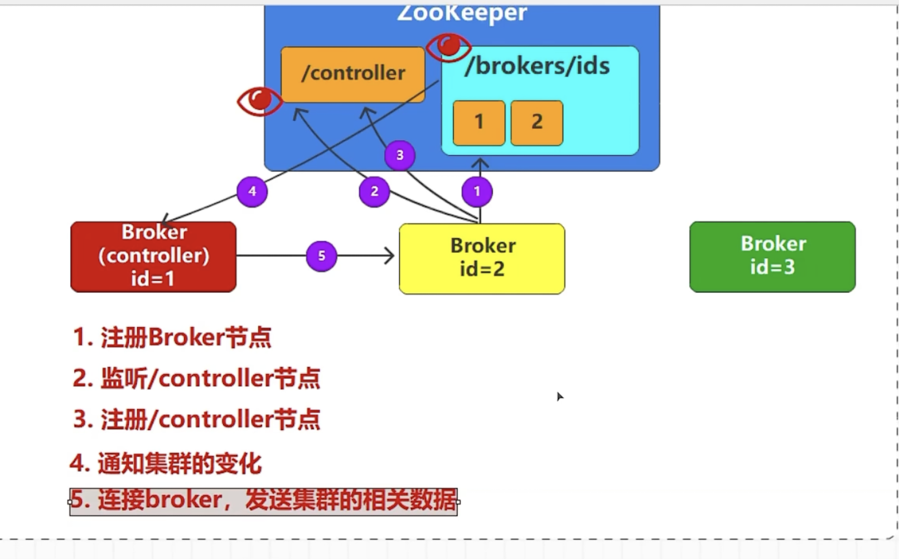
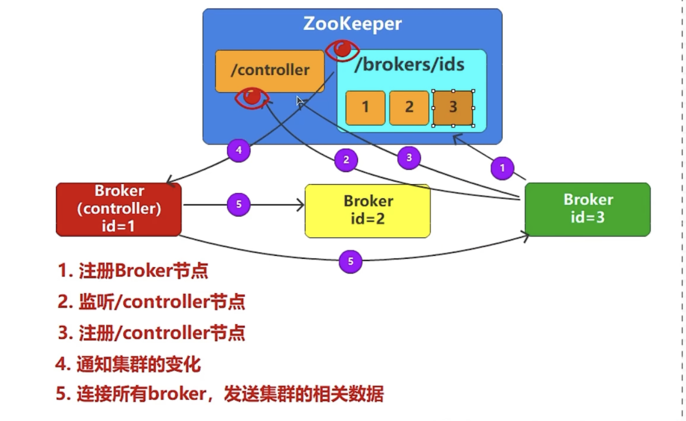
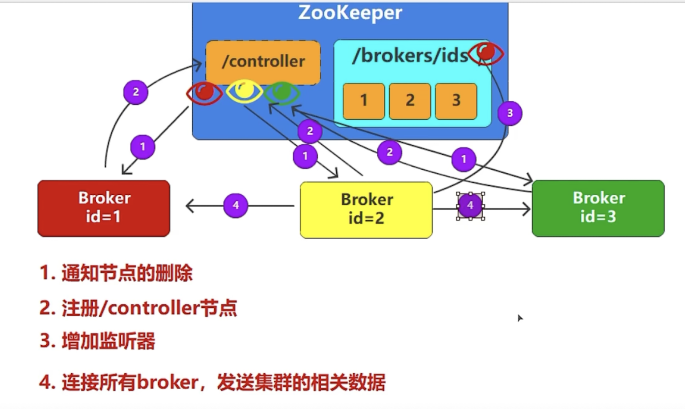

kafka controller选举过程
首先有三个broker, 他们就去尝试往zookeeper创建节点，谁先创建成功，谁就是集群的管理者，然后之后剩下的两个节点尝试创建，发现已经有节点了，就会建立监听，去监听节点的变化，一直等到集群管理者死了，然后zookeeper就删除该节点，然后监听的节点发现之后会马上尝试创建

第一个broker启动的流程：
注意这里第四点监听borkers是监听有没有新的broker连接进来加入集群

第二个broker启动的流程：
需要注意的是zookeeper节点的原子性和唯一性，只能有一个节点被创建成功成为controller

第三个broker启动的流程：
1. 去zk注册broker节点
2. 监听controller，建立一个监听
3. 发现controller已经有了管理者，注册controller节点失败
4. zk会通知多了一个新的broker告诉管理者
5. broker管理者连接***所有***broker，发送集群的相关数据

controller节点删除的情况：
