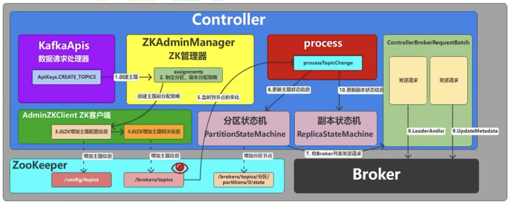
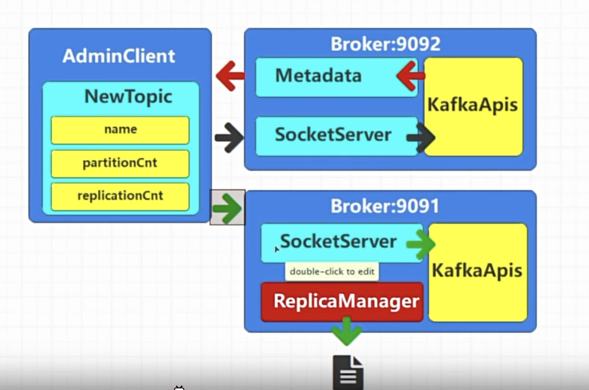
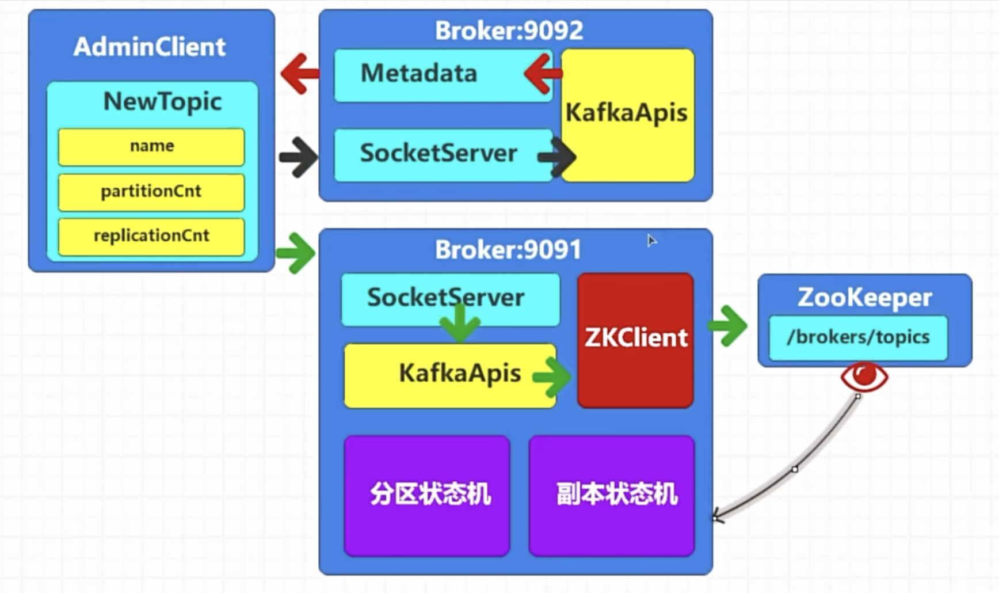

# create topic

我们在代码的时候`bootstrap-server localhost:9092`的broker不一定就是管理者，那么实际上kafka的处理其实如下图，因为每一个broker都知道集群里面其他broker以及集群信息，知道controller在什么位置，然后把topic创建出来

上图其实我们是省略了zkclient以及分区状态机的，实际上创建topic的时候，因为我们之前在controller提到，broker controller会监听zookeeper，然后创建topic的时候会使用zkclient去查看topic信息然后调用了分区状态机以及副本状态机
