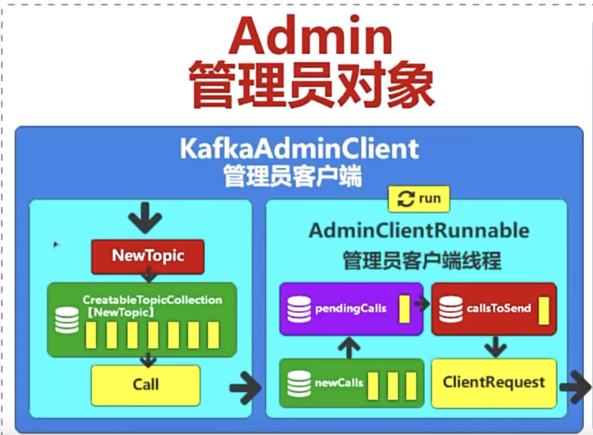
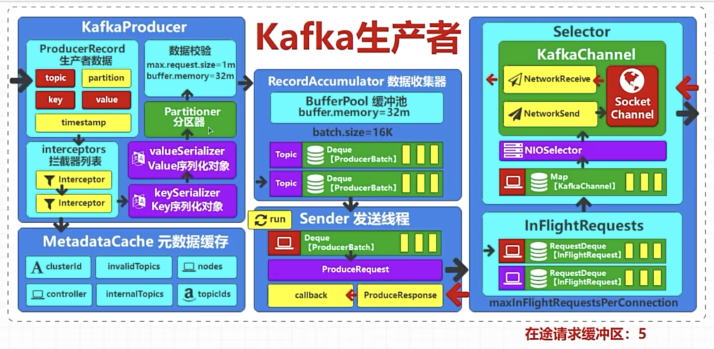
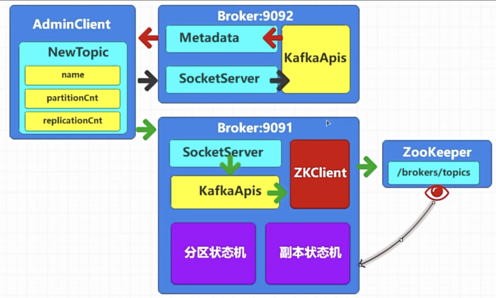
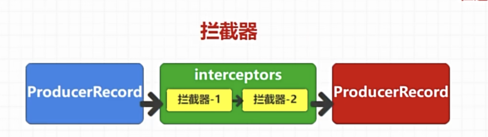
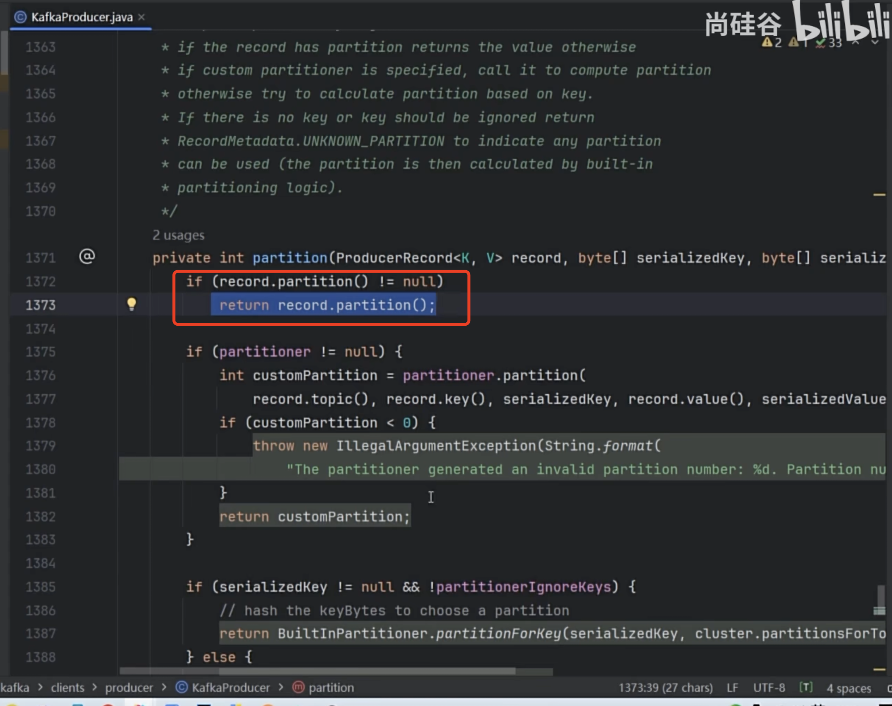
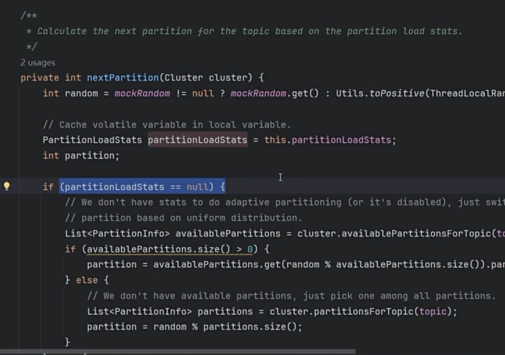
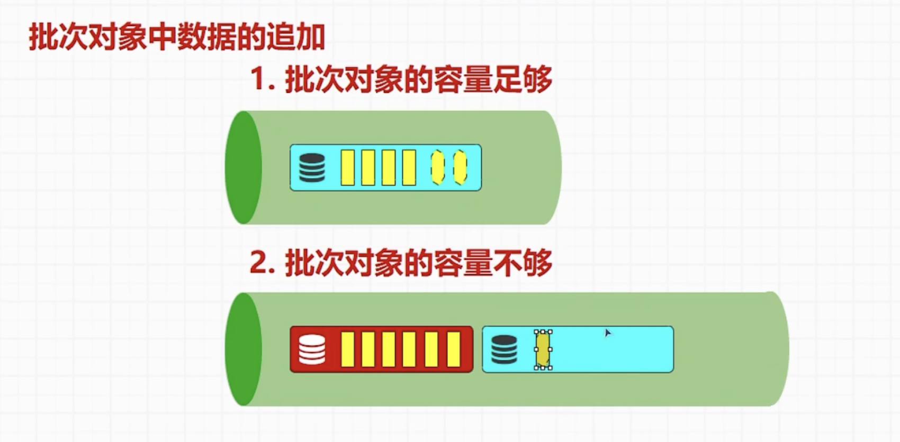

# 生产者

其实在producer例子的代码里面，我们可以看到我们往producer发送数据的时候，除了topic key value还可以有一个partition的参数也就是可以发送的时候指定partition

# 拦截器和序列化
在上面的图可以看到生产者数据准备好之后会先发送到拦截器列表，然后获取metadata cache信息包括clusterid,ndoes, controller ,internaltopics等然后进入到序列化对象

# metadataCache
拿到整个metadata包括nodes, controller等信息，给下一个partitioner分区器去计算要提供的生产者数据的topic到底存放到哪个broker毕竟好

# 计算分区器
如果用户在创建topic的时候指定了分区，kafka是不会校验直接使用指定的分区

如果分区器返回的是一个unknow的无效分区，其实后面传输数据之前会再次计算分区，他会开始根据节点的负载情况去计算，如果所有的分区当前都没有数据的情况下，会随机来选择分区，如果已经有数据，则会使用权重以及算法来计算

# RecordAccumulator数据收集器
要注意进来RecordAccumulator数据收集器之前我们是已经计算好了分区器，知道消息要往哪个分区器放。
kafka内部其实还有一个小的生产消费模式，也就是数据收集器这里，首先在kafka内部并不是来一条数据就发出去，他内部会通过计算进来的record的大小，如果超过batch.size就会按照topic来切分，然后放进去一个小型的队列也就是Deque里面
这里要注意，在Dqueue里面，如果我们一次发送的数据小于batch.size也就是默认16K，会满足容量足够然后组成批次发送出去。如果发送的数据大于batch.size比如说18K，他会首先组成一个小批次16K然后马上锁定，然后发送到下面的Sender发送线程， 然后剩下的2K数据会在后面再组一个新的批次。他一定会保持数据的完整性

# Sender发送线程
由于上面RecordAccumulator数据收集器发送过来的数据是按topic 分类发过来的，而不同的topic有可能是要发往同一个broker的，在Sender中，他会把消息重新组合，然后按broker来分类，同一个broker的消息一起发送过去同一个broker,然后把请求发送到网络客户端，通过网络客户端往服务器发送