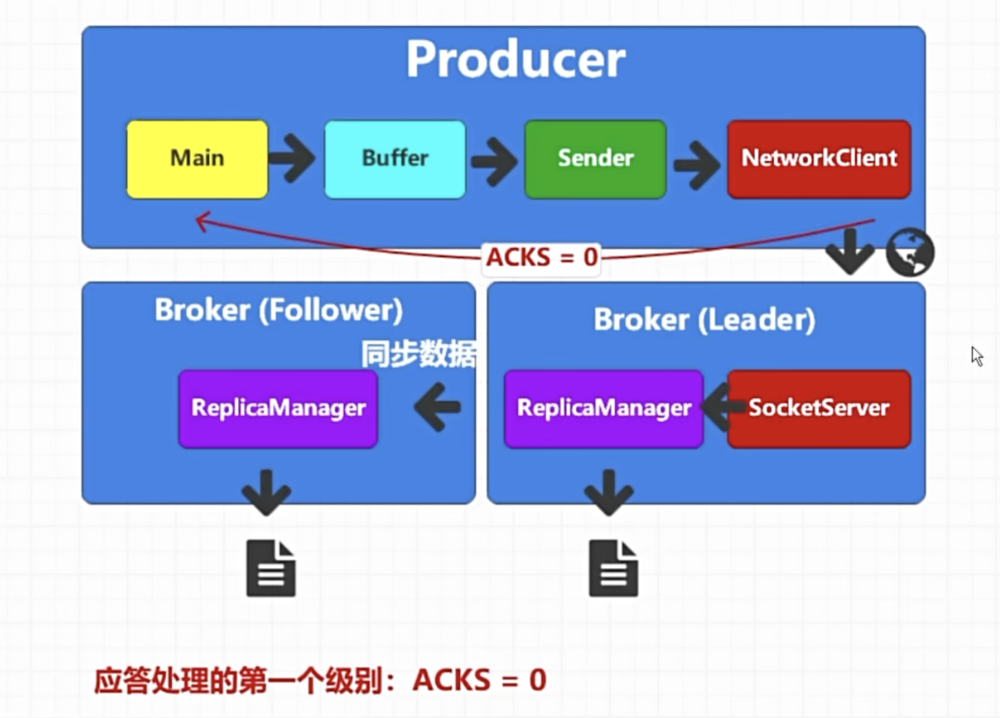
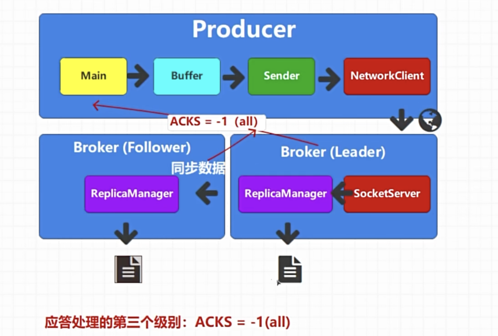
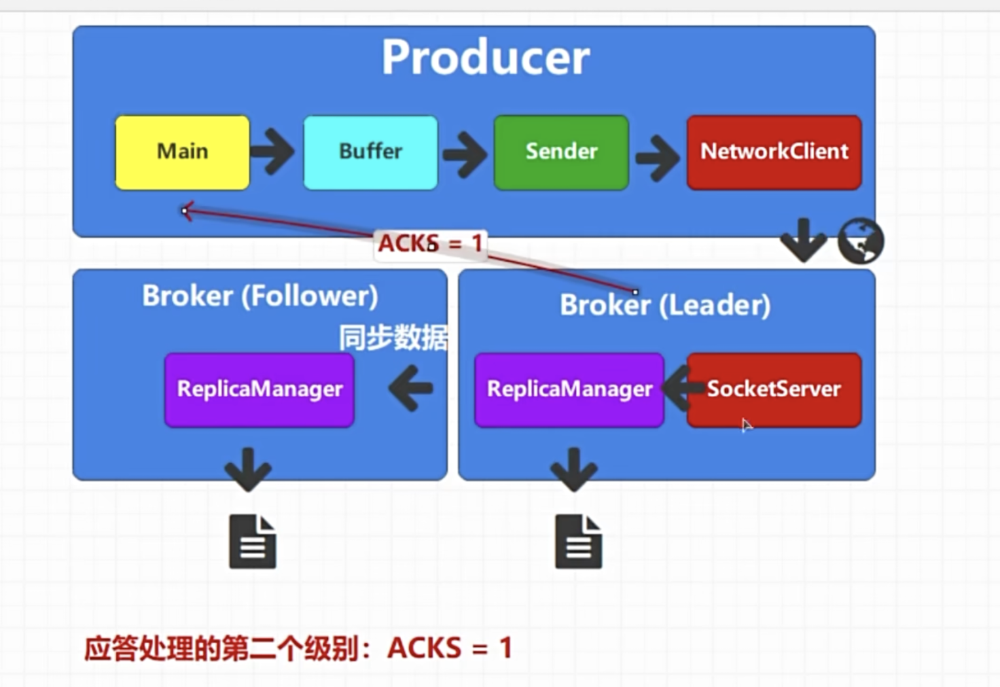

# acks=0
这个级别是对数据安全性要求不高的时候设置的，但是效率会很高，因为他不需要等待，他只要放到Networkclient就默认当发送成功就发送下一条

# acks=-1（all）
这个级别会等待broker leader写入数据并且follower也同步完成再应答
发送效率会非常低，但是安全性最高

# acks=1
该级别不需要等待所有Follower同步，只需要等leader写入数据就应答
