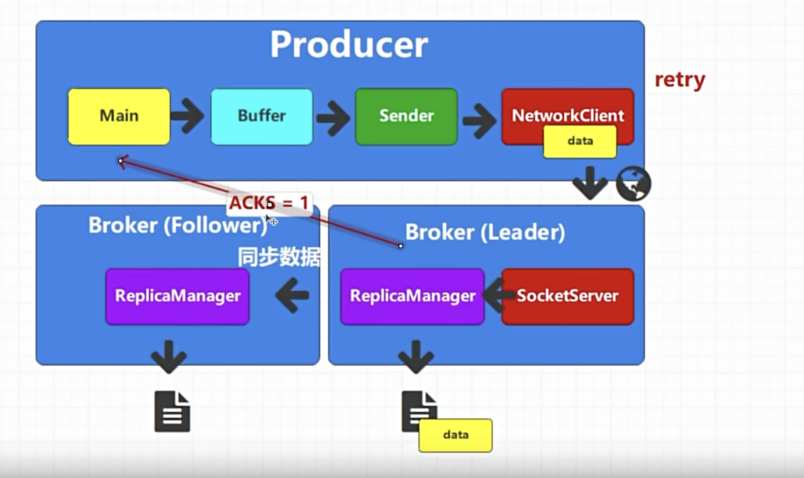
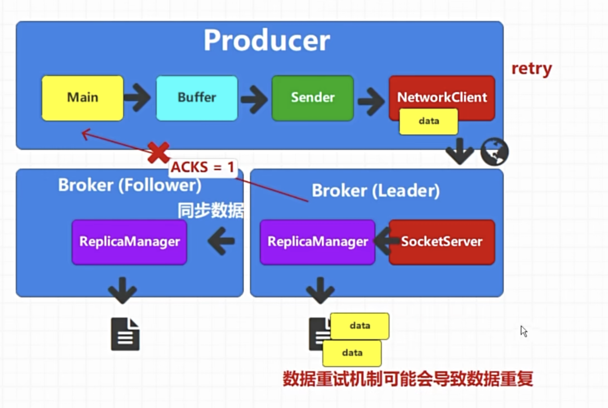
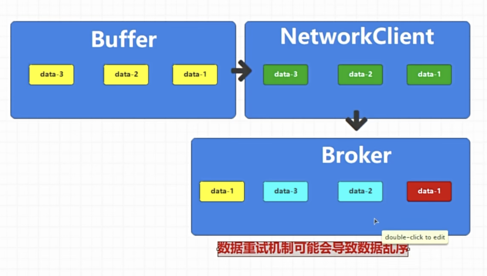
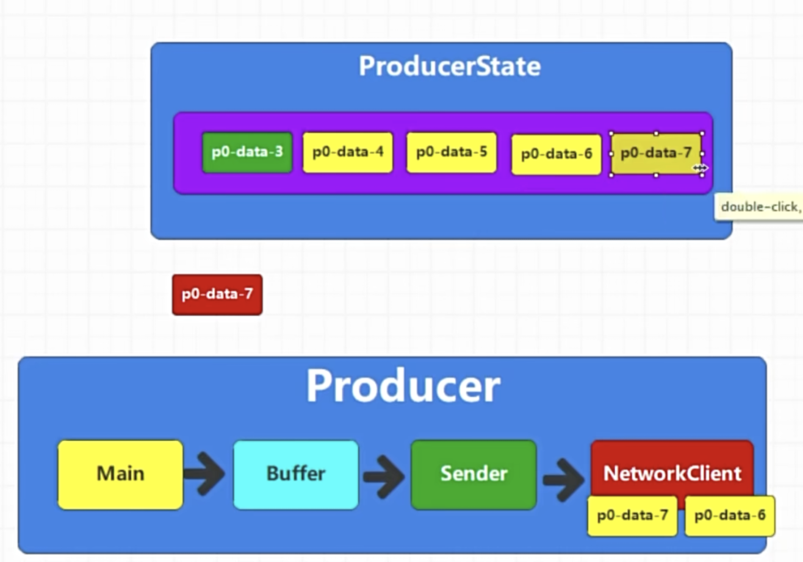

# Kafka消息重试机制
kafka有一个retry机制来保证消息的可靠性，当data从networkclient发送到broker leader发送成功，并且leader将数据写入磁盘之后应答之后就不会触发Retry,但是当leader刚好挂掉一直没有回应的时候，这个时候就会触发retry。

那么当刚好broker leader写入磁盘完成，准备发送应答的时候，这个时候网络不稳定，然后producer就会以为数据没有发送成功，再次retry发送，如下图所示，这个时候就会导致消息重复

网络不稳定在data1写入失败的时候，这个时候retry机制会重发data1,导致消息顺序不一致如下图

# 幂等性操作
kafka的幂等性是为了解决数据重复以及数据乱序出现的，开启幂等姓之后，数据会带上生产者id+数据的顺序号码
另外开启幂等性操作必须acks=-1
注意在途缓冲区数量不要大于5，大于5会出问题
幂等姓其实只能对同一个分区起作用
他会首先比较数据是否重复，如果是就不插入
然后比较数据的顺序，数据的顺序在同一个分区起作用

