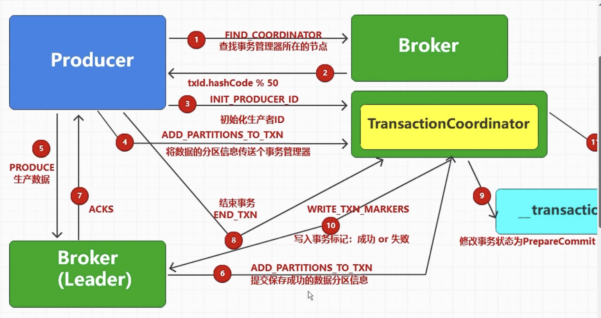

生产者ID不变，事务就不会失效

Kafka 的生产数据事务操作（Transactional Messaging）主要是为了在分布式场景下保证消息生产的**原子性**和**一致性**，解决以下核心问题，确保数据传输的可靠性：

### 1. **解决“消息重复”与“消息丢失”的矛盾**
在分布式系统中，生产者发送消息时可能因网络波动、 broker 故障等导致重试。若无事务机制：
- 若重试成功但生产者未收到确认，可能导致**消息重复**（同一消息被多次写入）。
- 若消息已写入但确认丢失，生产者可能放弃发送，导致**消息丢失**。

事务机制通过“幂等性 + 事务标识”确保：  
- 即使重试，相同事务内的消息也只会被成功写入一次（去重）。  
- 要么事务内的所有消息都成功写入，要么全部失败（原子性），避免部分成功导致的数据不一致。

### 2. **支持“多分区原子写入”**
当生产者需要向**多个分区**发送关联消息（例如：一笔订单的支付消息和库存消息需分别写入两个分区），事务可保证这些消息“要么全成功，要么全失败”。  

例如：  
- 若订单支付成功，需同时写入“支付日志分区”和“库存扣减分区”。  
- 若中途失败，事务会回滚所有已写入的消息，避免出现“支付记录存在但库存未扣减”的不一致状态。

### 3. **与消费者偏移量（Offset）联动，保证“生产-消费”一致性**
Kafka 事务允许将“消息生产”与“消费者偏移量提交”绑定在同一事务中，解决“消费了消息但偏移量未提交”或“偏移量提交了但消息处理失败”的问题。  

典型场景：  
- 消费者从 Topic A 读取消息，处理后生产到 Topic B，同时需要提交 Topic A 的消费偏移量。  
- 事务可确保：只有 Topic B 成功写入且业务处理完成，才会提交 Topic A 的偏移量；若任一环节失败，所有操作回滚，避免数据错乱。

### 4. **满足金融、电商等场景的“数据可靠性合规”**
在对数据一致性要求极高的领域（如金融交易、订单系统），事务是必须的保障机制：  
- 避免因系统故障导致的重复交易、漏单等问题。  
- 满足审计要求，确保数据可追溯且状态一致。

### 总结
Kafka 生产数据的事务操作本质是通过**原子性提交**和**幂等性保障**，解决分布式环境下消息传输的“一致性”问题，尤其适用于需要向多分区写入关联消息、或生产与消费操作需联动的场景，是 Kafka 实现高可靠性的核心能力之一。
