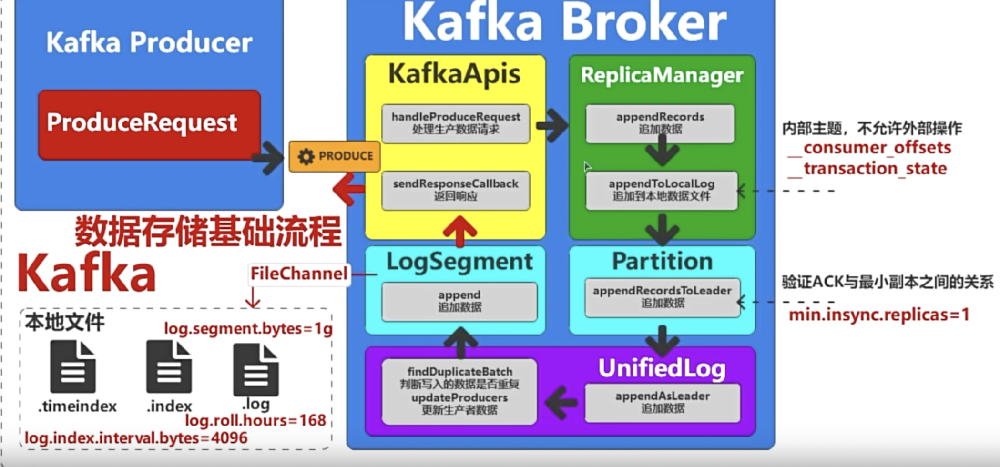
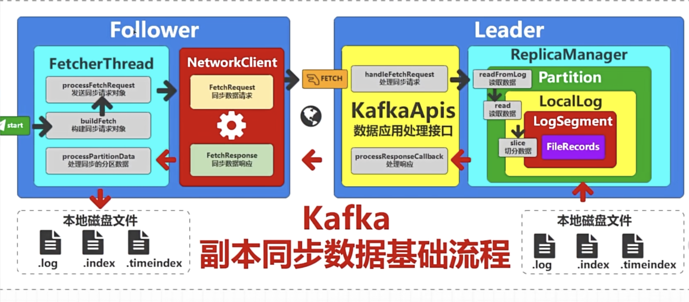
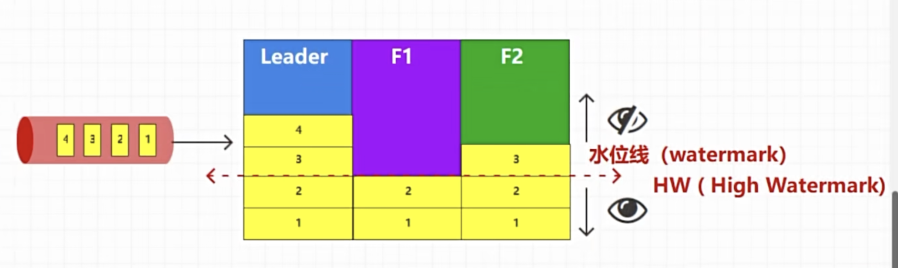
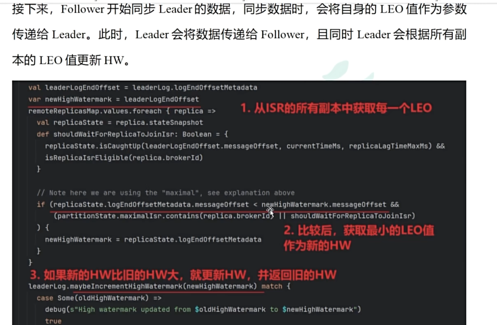
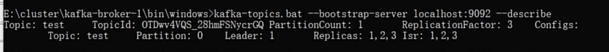
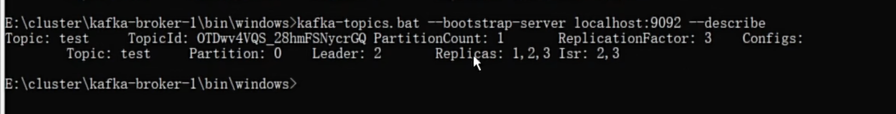

前面我们提到，producer发数据进来之后leader所在broker接收到消息之后会先将消息存入内存缓冲区in-memory buffer,这个时候消息尚未持久化到磁盘，只是在内存等待批量处理，是为了减少磁盘IO次数，

## 消息追加到日志文件（持久化）
Kafka的每一个分区会对应一组日志文件也就是log segments，消息按写入顺序追加到当前active segment末尾，保证分区内的消息顺序性（通过offset标记顺序）
* 日志文件以分段形式存储（默认单个文件最大 1GB），文件名以该段的起始 Offset 命名（如 00000000000000000000.log）。
* 写入时采用 顺序 I/O（磁盘的顺序写入性能远高于随机写入），这是 Kafka 高吞吐的关键优化之一。
## 生成索引文件
每写入一批消息，Kafka 会同步更新对应的 索引文件，用于快速定位消息：
* 偏移量索引（.index）：记录消息 Offset 与在日志文件中物理位置（字节偏移）的映射，支持通过 Offset 快速找到消息。
* 时间戳索引（.timeindex）：记录消息时间戳与 Offset 的对应关系，支持按时间范围查询（如 “获取近 1 小时的消息”）。

## 刷盘（Flushing）到磁盘
内存中的消息不会立即写入磁盘，而是通过两种机制触发刷盘：
* 按消息数量：当缓冲区消息数达到 log.flush.interval.messages 配置（默认无限制，依赖操作系统）。
* 按时间间隔：当距离上次刷盘时间达到 log.flush.interval.ms 配置（默认 5 秒）。
此外，操作系统的 页缓存（Page Cache） 会自动将内存数据异步刷盘，平衡性能与可靠性

## 副本同步（Replication）
消息写入 Leader 副本后，Follower 副本会定期从 Leader 拉取消息（通过 Fetch 请求），并重复步骤 3-5 将消息写入自己的日志文件，保持与 Leader 数据一致。
只有当消息被写入 ISR（In-Sync Replicas，同步副本集） 中的所有副本（或达到 min.insync.replicas 配置的最小数量），Leader 才会向生产者返回 “写入成功” 确认，确保数据可靠性。

## 日志文件的生命周期管理
为什么提起这个，kafka设计是为了传输数据而不是存储数据。
随着消息不断写入，日志文件会通过以下策略自动清理或归档：
按时间保留：超过 log.retention.hours（默认 168 小时，即 7 天）的日志段会被删除。
* 按大小保留：当分区总大小超过 log.retention.bytes 时，删除最旧的日志段。
* 日志压缩：若主题配置 cleanup.policy=compact，则只保留每个 Key 的最新版本消息，旧版本被清理（适用于需要保留最新状态的场景）。

总结：核心特点
顺序写入：通过 Append-Only 机制和日志分段，最大化磁盘 I/O 效率。
分区隔离：每个分区独立存储，实现并行读写，提升吞吐量。
副本同步：通过 ISR 机制保证数据在集群中的可靠性。
索引优化：通过 Offset 和时间戳索引，支持高效的消息查询和消费。

follewer是有一个进程定时往leader抓取数据回来写入

我们假设一个场景，两个follower都在往leader拉去数据回来，但是都没有同步完成的时候Leader就挂机，如下图所示

那么用户读取数据的时候数据就没有完整，这个时候其实就是引入我们著名的木桶理论，也就是能存放多少水是取决于最短木桶的板子，kafka称之为水位线，用户能读取到的数据就是水位线以下的数据，也就是1和2，这个水位线我们也可以跟kafka的offset偏移量对标，水位线随着follower的同步数据变化增加。
一旦切换当前的leader,我们的数据4就要被丢掉，这就是我们数据同步的一致性问题

LEO缩写是log end offset，也就是记录日志Offset, 当follower同步leader数据的时候会把自己的LEO发给leader,然后leader计算将数据传递给follower并且同时将follower的LEO的值更新水位线值HW

我们使用命令查看现在leader是1， follower可以查看ISR

当leader 1 挂了，他会先从ISR列表第一个出列当Leader,也就是下图的2，然后当1恢复之后他会加入ISR列表的末尾也就是3的后面

