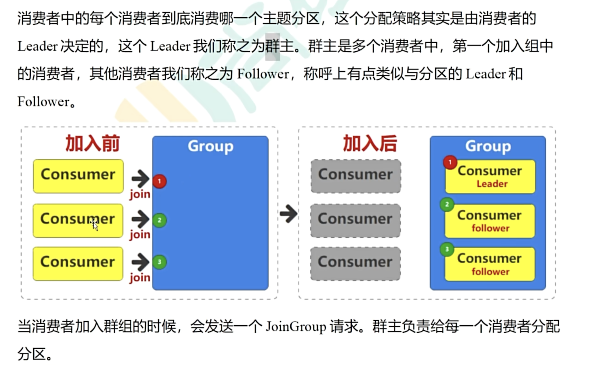

# 消费组
kafka 消费组的个体数量应该小于等于topic数量
如果大于，那么多出来的则无法消费数据
如下图所示，如果4个消费者，3个topic,那么只有当其中一个在消费中的消费者Down, 多出来的才可以消费数据，这个时候问题来了，他消费的数据是从头开始还是从down的消费者消费完的数据offset开始呢 ，可是问题来了，消费的offset数据在Kafka哪里保存呢

我们来看看kafka, kafka有一个topic叫`__consumer_offsets`是记录消费，专门用于存储消费者（Consumer）的消费偏移量（Offset） 信息。它是 Kafka 实现消费状态管理的核心机制，解决了分布式场景下消费者如何记录消费进度的关键问题。确保消费者重启、重平衡（Rebalance）或集群故障后，能从上次中断的位置继续消费，避免重复消费或消息丢失。

存储格式
每个消息的 Key 是 (消费者组 ID, 主题名, 分区号)，Value 是该消费者组在对应分区的最新 Offset 及元数据（如提交时间戳）。
例如：Key = (group1, topicA, 0), Value = (offset=100, timestamp=1620000000) 表示 “group1 消费 topicA 的 0 号分区到了 Offset=100”。

消费者分配策略
一个分区一个时刻只能被一个消费者消费
当组员发生变化的时候，topic分区数据发生变化时候，会重新调整分区和消费者对应关系

