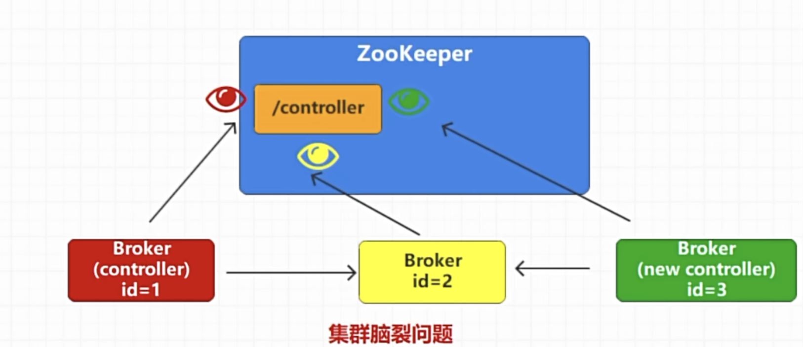
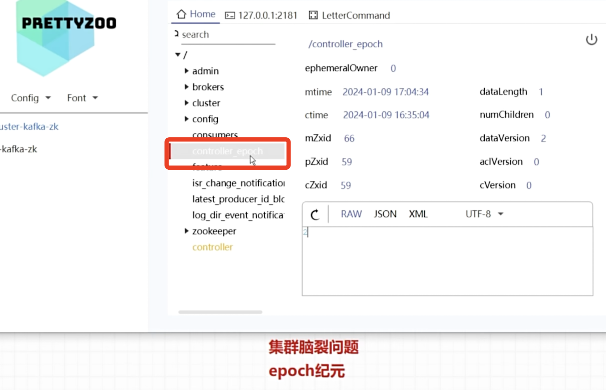

下面我们来说集群脑裂情况
broker1假设现在是集群Leader， 但是因为网络故障情况，超过了timeout,这个时候集群就把它剔除，然后broker3马上抢占成为leader, 刚好这个时候broker1网络恢复，因为集群leader都会跟剩下Broker通信，这个时候broker2就同时收到来自broker1 broker3都说自己是leader


那么kafka应对脑裂这种情况会有一个叫controller_epoch来告诉最新总统是第几届, broker1会告诉broker2我是第一届总统，broker3会告诉broker2我是第二届总统，然后broker2去查询controller_epoch就知道谁是最新leader然后听他的



在 Kafka 中，**Leader 脑裂（Leader Split-Brain）** 是指一个分区（Partition）在集群中同时出现多个“自认为是 Leader”的副本（Replica）的异常状态。这种情况会导致数据不一致（生产者可能向不同 Leader 写入数据，消费者读取到冲突数据），是分布式系统中典型的一致性风险。


### 一、Leader 脑裂的成因
Kafka 的分区 Leader 由 **控制器（Controller）** 统一管理（控制器是集群中一个特殊的 Broker，负责 Leader 选举、分区状态维护等）。脑裂通常由以下原因导致：

1. **网络分区（Network Partition）**  
   集群中部分 Broker 与控制器/ ZooKeeper 之间发生网络隔离，导致不同 Broker 对“谁是 Leader”的认知出现分歧：  
   - 隔离区外的 Broker 认为原 Leader 已宕机，控制器重新选举了新 Leader；  
   - 隔离区内的原 Leader 仍认为自己是 Leader（因无法收到控制器的新指令），继续处理读写请求。

2. **控制器故障与重新选举**  
   控制器宕机后，集群会重新选举新控制器。若旧控制器未彻底下线（如短暂卡顿后恢复），新旧控制器可能同时向集群发送 Leader 管理指令，导致 Broker 收到冲突信息。

3. **Broker 时钟或状态同步异常**  
   个别 Broker 因时钟偏移、元数据同步延迟等，未及时更新分区 Leader 状态，仍保留旧 Leader 信息。


### 二、日志中提示脑裂的关键信息
Kafka 的 Broker 日志（默认路径 `logs/server.log`）和控制器日志中会出现以下特征信息，可用于识别脑裂：

1. **Leader 冲突日志**  
   当 Broker 检测到同一分区存在多个 Leader 时，会记录类似：  
   ```log
   [Partition [topic-1,0]] Conflict in leadership detected: current leader is broker 2, but received a request from broker 1 claiming to be leader. Epoch of current leader: 5, epoch of claimant: 3.
   ```  
   （翻译：分区 [topic-1,0] 检测到 leadership 冲突：当前 Leader 是 broker 2，但收到 broker 1 声称自己是 Leader 的请求。当前 Leader 的 epoch 是 5，声称者的 epoch 是 3。）

2. **Epoch 不匹配警告**  
   Kafka 为每个 Leader 分配一个递增的 **Epoch 编号**（每次 Leader 变更时 +1），用于标识 Leader 的“合法性”。旧 Leader 的 Epoch 会小于新 Leader，当旧 Leader 尝试处理请求时，其他 Broker 会拒绝并记录：  
   ```log
   [Partition [topic-1,0]] Rejected request from old leader broker 1 (epoch 3) because current leader is broker 2 (epoch 5)
   ```  
   （翻译：拒绝来自旧 Leader broker 1（epoch 3）的请求，因为当前 Leader 是 broker 2（epoch 5）。）

3. **频繁的 Leader 切换**  
   脑裂发生时，分区可能在短时间内频繁切换 Leader，日志中会出现大量：  
   ```log
   [Partition [topic-1,0]] Leader changed from broker 1 to broker 2
   [Partition [topic-1,0]] Leader changed from broker 2 to broker 1
   ```  
   （频繁交替的 Leader 变更记录）

4. **控制器与 Broker 通信异常**  
   控制器日志（`logs/controller.log`）中可能出现：  
   ```log
   [Controller id=3] Failed to send LeaderAndIsr request to broker 1 (id=1). Reason: Network exception
   ```  
   （控制器无法与 broker 1 通信，可能导致 broker 1 状态孤立）


### 三、Kafka 如何处理和预防脑裂
Kafka 通过多重机制避免脑裂，或在发生时快速恢复一致性：

#### 1. **控制器唯一性与 ZooKeeper 协调**  
   - 控制器通过 ZooKeeper 的 **临时节点（/controller）** 保证唯一性：只有成功创建该节点的 Broker 才能成为控制器，其他 Broker 会监听该节点，一旦节点消失（旧控制器宕机），立即触发重新选举。  
   - 所有 Leader 变更指令均由唯一控制器发出，避免“多头指挥”。

#### 2. **Epoch 机制：标识 Leader 合法性**  
   - 每个分区的 Leader 都有一个 **Epoch 编号**（初始为 0，每次 Leader 变更时自动 +1），该编号会同步到所有副本和控制器。  
   - 当一个 Broker 收到请求时，会检查请求中的 Epoch 是否与自己记录的当前 Leader Epoch 一致：  
     - 若请求 Epoch 更小（旧 Leader），则拒绝该请求（如“旧 Leader 发送的写入请求”会被 follower 或新 Leader 拒绝）；  
     - 若 Epoch 更大，则更新本地记录，认可新 Leader。  
   - 这一机制从根本上杜绝了“旧 Leader 继续生效”的可能。

#### 3. **ISR 集合与数据同步校验**  
   - Leader 选举时，控制器只会从 **ISR（In-Sync Replicas，同步副本集）** 中选择新 Leader，确保新 Leader 拥有最新的数据（与旧 Leader 数据一致）。  
   - 若网络分区导致旧 Leader 与 ISR 隔离，其数据无法同步到其他副本，即使它自认为是 Leader，也会因“不在 ISR 中”被排除在新 Leader 选举之外。

#### 4. **Broker 状态定期同步**  
   - 所有 Broker 会定期向控制器发送心跳（`controller.session.timeout.ms`，默认 6000ms），报告自身状态。  
   - 控制器会定期向所有 Broker 同步分区元数据（包括最新 Leader 和 Epoch），确保集群状态一致。若某个 Broker 长时间未同步，会被标记为“异常”，其发出的请求会被忽略。

#### 5. **自动恢复流程**  
   若短暂脑裂发生（如网络分区恢复）：  
   - 隔离的旧 Leader 会重新连接到控制器，获取最新的 Leader 和 Epoch 信息，自动放弃 Leader 身份；  
   - 控制器会强制同步所有 Broker 的分区状态，确保全集群认可同一 Leader；  
   - 对于旧 Leader 在隔离期间写入的“孤悬数据”（未同步到新 Leader），会被标记为无效并清理（因不符合 ISR 一致性）。


### 总结
Kafka 的 Leader 脑裂本质是“集群状态认知不一致”，主要由网络分区或控制器异常引发。通过 **控制器唯一性**、**Epoch 合法性校验**、**ISR 同步机制** 和 **定期状态同步** 等手段，Kafka 能有效预防脑裂，并在发生时快速恢复一致性，确保数据可靠性。日志中的“Leader 冲突”“Epoch 不匹配”和“频繁 Leader 切换”是识别脑裂的关键线索。