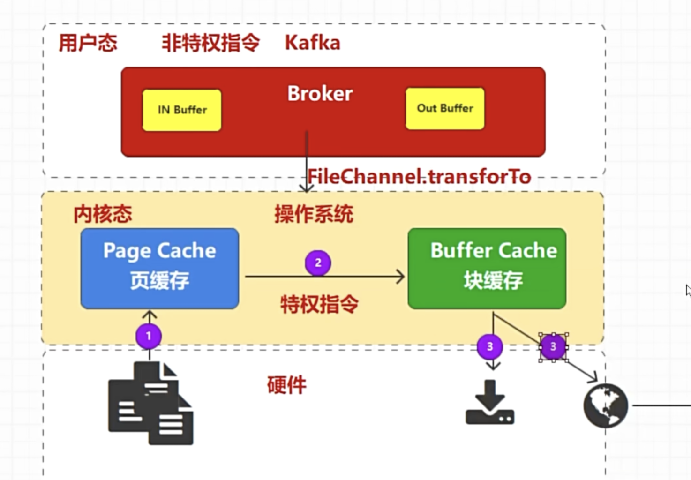

在没有零拷贝情况下，消费者从kafka消费消息会经历四次拷贝
1. 磁盘文件->内核page cache, 从硬件文件拷贝到page cache页缓存，这里无需CPU参与
2. 内核page cache-> kafka IN Buffer， CPU将数据从内核态拷贝到用户态的Kafka in buffer
3. Kafka  Buffer -> Buffer Cache, CPU将数据从用户态到内核态的块存储
4. 通过Socket->网络
整个过程会两次用户态/内核态切换，CPU开销大效率低

零拷贝情况下
其实无需数据非要经过Kafka, Kafka通过Sendfile来实现零拷贝，直接从磁盘文件到内核page cache,然后从内核page cache到socket发送到网络

