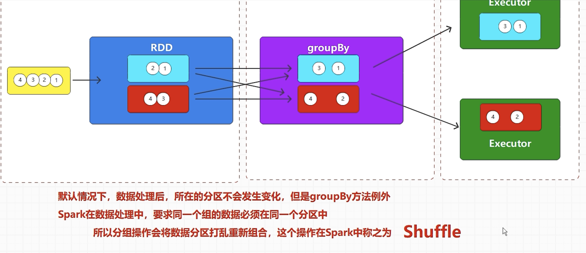
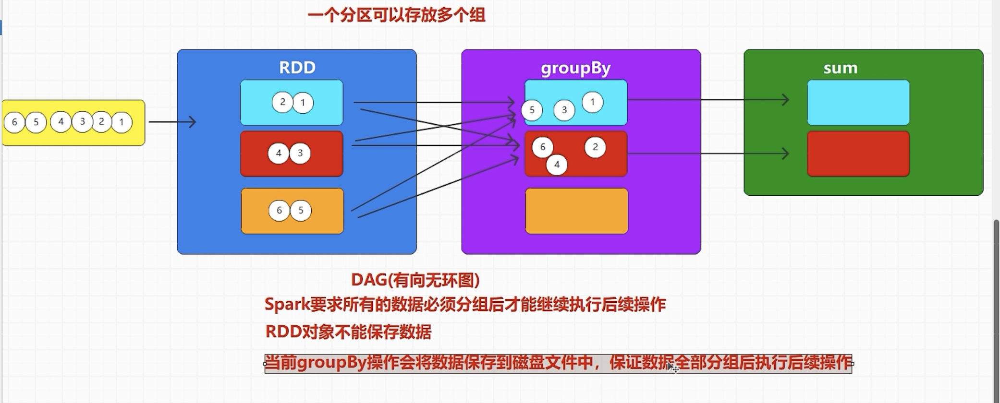
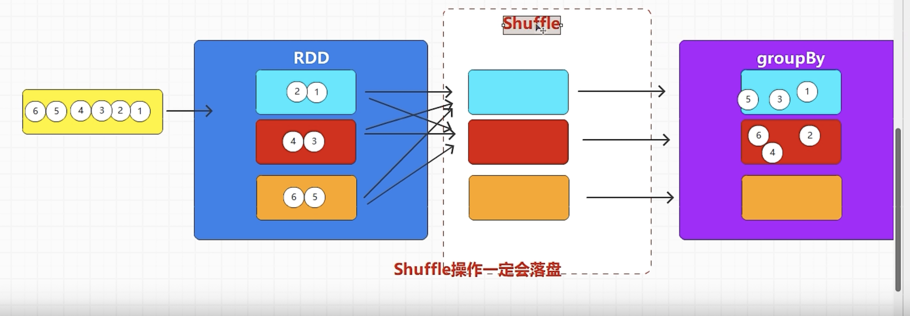

# rdd groupBy算子：按照指定的分组规则对数据分组

因为rdd计算是在driver端计算，但是执行在executor端执行，
那么是怎么来判断数据应该分在哪个rdd呢，其实是标记法，spark把每一条数据都增加一个标记，相同标记会放在一个组里
比如我们要把数据按基数偶数分开计算求和,会把rdd的数据分区打乱再重新组合，这个操作就是叫shuffle

shuffle操作必定写磁盘，因此容易成为性能瓶颈

