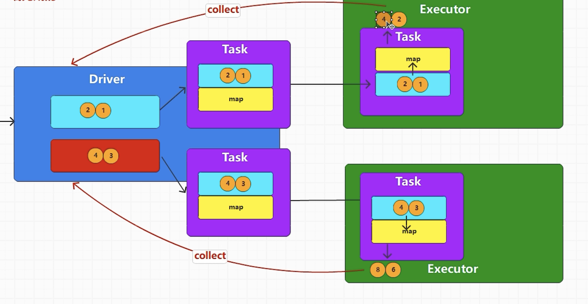

spark中，功能组合在driver端完成
功能的执行在executor端完成

```java
public class SparkAction {
    public static void main(String[] args) {
        final SparkConf conf = new SparkConf();

        conf.setMaster("local[*]");
        config.setAppName("spark");

        final JavaSparkContext jsc = new JavaSparkContext(conf);

        final List<Integer> nums = Arrays.asList(1,2,3,4);
        final JavaRDD<Integer> rdd = jsc.parallelize(nums, 2);

        final JavaRDD<Object> newRDD = rdd.map(num -> num *2);

        // collect就是行动算子
        // collect方法就是将Executor端执行的结果按照分区的顺序拉回来到Driver端，将结果组合成对象
        newRDD.collect().forEach(System.out::println);

        jsc.close();
    }
}