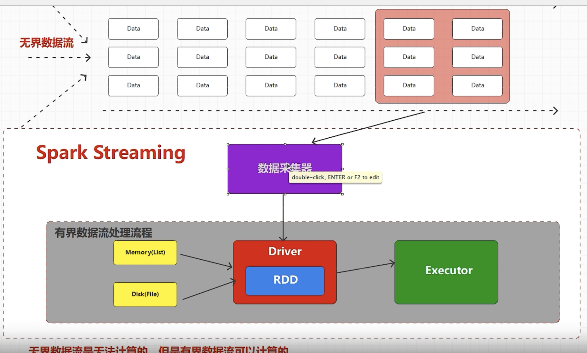
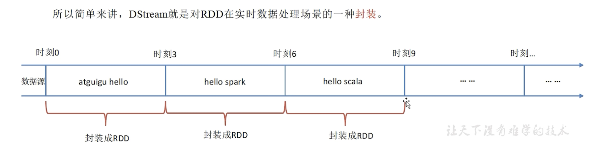

spark streaming: 在特定场合下，对Spark core(RDD) 的封装
有界数据流：List， 文件
无界数据流：源源不断的数据进来
无界数据流是无法计算的

spark streamimng：  无界数据流(stream) +  action


spark streaming的底层还是spark core

从数据处理方式的角度：
    流式数据处理：一个一个数据处理
    微批数据处理：一小批一小批数据处理
    批量数据处理：一批一批数据处理

从数据处理延迟的角度：
    实时数据处理：数据处理的延迟以毫秒为单位
    准实时数据处理：数据处理的延迟以秒，分钟为单位
    离线数据处理：数据处理的延迟以小时，天为单位

Spark是批量离线处理框架
SparkStreaming是对Spark的封装，是微批框架




```java
public class SparkStream {
    public static void main(String[] args) {
        final SparkConf conf = new SparkConf();

        conf.setMaster("local[*]");
        config.setAppName("sparkstream");

        final JavaStreamingContext jsc = new JavaStreamingContext(conf, new Duration(3 * 1000));

        final JavaReceiverInputDStream<String> socketDS = jsc.socketTextStream("localhost", 9999);
        socketDS.print();

        // 启动数据采集器
        jsc.start();
        // 等待采集器的结束
        jsc.awaitTermination();

        // 数据采集器是长期执行的，不能停止也不能释放资源
        // jsc.close();
    }
}
```

// 139集