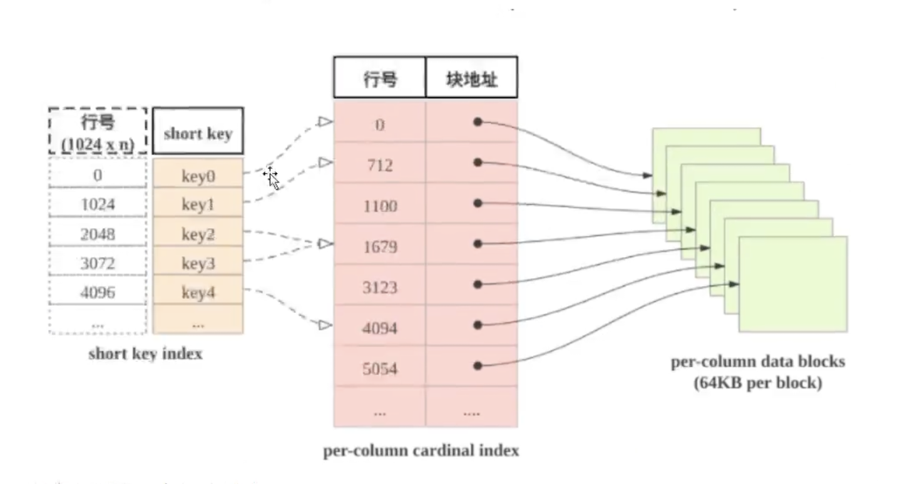

starrock中表中数据按列存储

# 稀疏索引
starrock如何快速定位起始目标呢？是使用了shortkey index, shortkey index为稀疏索引

他会先分块，表中数据每1024为一个逻辑块，每个逻辑块都会在shortkey index存储一个索引，从行号0到1023为一块，1024到2027为一块如此类推，假如说我们要查询1025行，那么他会先找到1024起的数据块，通过这个索引查找块地址，然后寻找这个数据块，然后对这个数据块解压缩，然后对这个解压后的数据块来查找数据

# 数据模型
## 明细模型
Duplicate key
频繁使用的维列作为排序键，比如用户需要查看某一个世界，可以把时间和实践类型作为排序键
建表的时候指定模型和排序键

聚合模型
Aggregate key
基于明细数据进行统计和汇总，比如说统计app访问流量，用户访问时长，访问次数等，举例：sum, count. max

更新模型
Unique key
数据需要进行更新，如果靠明细模型来做delete+insert是无法满足频繁更新需求，这个适合写入的数据已经有大量的更新需求并且实时数据分析

主键模型
Primary key
比更新模型更好支持实时/频繁更新，特别是配合Flink-connector-starrocks可以完成实时同步的方案

排序键
物化视图

